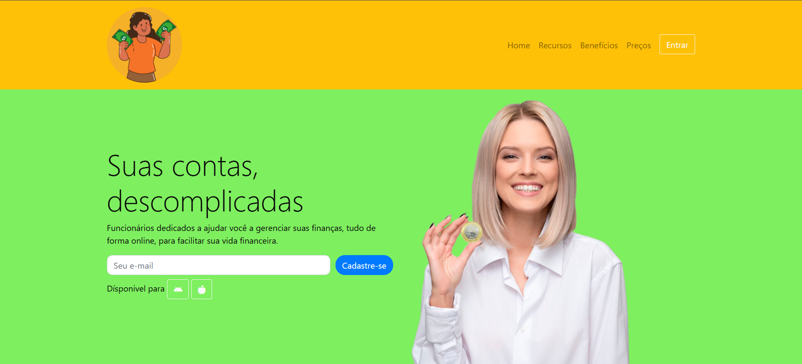

🧠 O projeto
Página Solution é um projeto introdutório desenvolvido com as tecnologias fundamentais do front-end:

  

Este foi meu primeiro projeto prático como desenvolvedora front-end, com o objetivo de aplicar e consolidar os conhecimentos iniciais em estruturação semântica, estilização responsiva e interatividade com JavaScript.

*****

✨ Funcionalidades
- Layout responsivo
- Botões com animações simples
- Estrutura HTML semântica
- Estilização moderna com CSS
- Interações básicas com JavaScript

*****
🚀 Deploy
Você pode visualizar o projeto online:

https://nandacoderdev.github.io/pagina-solution/
