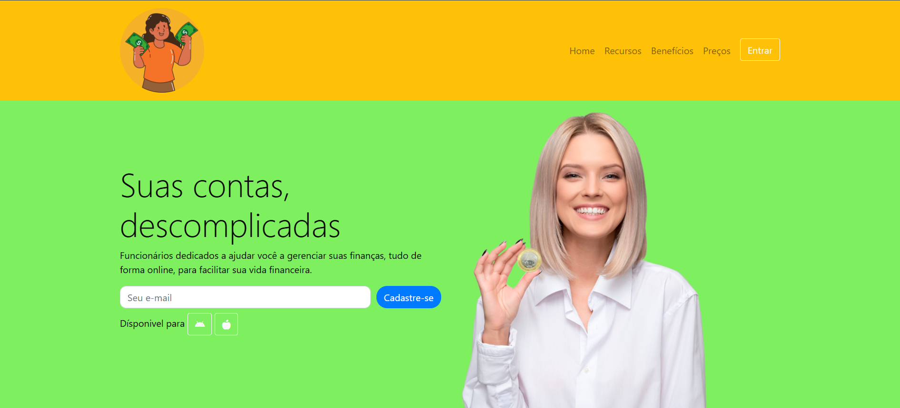

# 🌐 Página Solution

## Preview do projeto

Projeto prático de desenvolvimento front-end, criado para aplicar conceitos fundamentais de HTML, CSS e JavaScript.

## 🧠 Sobre o projeto
Este foi meu primeiro projeto prático como desenvolvedora front-end, com foco em estruturação semântica, responsividade e interatividade.

## 🚀 Tecnologias utilizadas

## ✨ Funcionalidades
- Layout responsivo
- Botões com animações simples
- Estrutura HTML semântica
- Estilização moderna com CSS
- Interações básicas com JavaScript

## 🔗 Deploy
Acesse o projeto online:

👉 https://nandacoderdev.github.io/pagina-solution/

## 🎯 Objetivo
Praticar desenvolvimento front-end e consolidar conhecimentos iniciais na criação de interfaces web.
